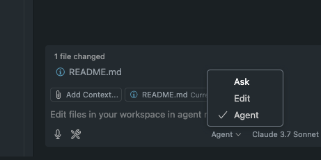

# GitHub Copilot Presentation

## Introduction (5 minutes)
- **What is GitHub Copilot?**
  - AI-powered code assistant trained on billions of lines of code
  - Helps developers write better code faster
  - Created through GitHub and OpenAI partnership

- **Why is it important?**
  - Increases developer productivity
  - Reduces time spent on repetitive coding tasks
  - Helps with learning new programming patterns and APIs

## Modes of Interaction (10 minutes)

### Ask Mode
- Natural language interaction through chat panel
- Great for:
  - Getting explanations of code behavior
  - Learning new programming concepts
  - Debugging issues
  - Implementation advice

### Edit Mode
- Select code and describe desired changes
- Perfect for:
  - Refactoring existing code
  - Adding error handling
  - Optimizing performance
  - Converting between patterns or styles

### Agent Mode
- Proactive assistance for complex tasks
- Enables:
  - Creating entire features from descriptions
  - Working across multiple files
  - Setting up project structures
  - Generating tests and managing dependencies

## Basic Usage Demo (10 minutes)

### Installation and Setup
1. Install the GitHub Copilot extension
2. Sign in with licensed GitHub account
3. Activation happens automatically

### Key Interactions
- **Inline suggestions** as you type (Tab to accept, Esc to dismiss)
- **Copilot Chat** for questions and guidance (Ctrl+Shift+I / Cmd+Shift+I)
- **Keyboard shortcuts** for efficient workflow

### Live Demo Ideas
- Create a new function with inline suggestions
- Ask Copilot to explain complex code
- Use Edit mode to refactor a function
- Try Agent mode for a small feature implementation

## Best Practices (5-10 minutes)

### Writing Effective Prompts
- Be specific and clear in instructions
- Use comments to guide Copilot's understanding
- Include contextual details (libraries, patterns, constraints)
- Break down complex requests into manageable parts

### Getting Better Suggestions
- Start with function signatures and types
- Include example inputs/outputs in comments
- Open related files for more context
- Use proper coding conventions

### Personal Example
- Share a specific instance where Copilot significantly helped
- Before/after comparison of time savings
- Unexpected solution discovered through Copilot

## Limitations and Considerations (5 minutes)

### Technical Limitations
- Code quality can vary and may include bugs
- Limited by context boundaries
- Documentation may be incomplete
- Performance varies by programming language

### Privacy and Security
- Code snippets are sent to OpenAI servers
- Avoid using with sensitive information
- Always review generated code for vulnerabilities
- Consider compliance with organizational policies

## Organizational Impact (5 minutes)

### Benefits
- Accelerated development cycles
- Reduced time on boilerplate code
- Faster onboarding for new team members
- Knowledge sharing across the team

### Implementation Strategy
- Start with non-critical projects
- Establish review guidelines
- Document productivity wins
- Keep learning about new capabilities

## Q&A (5-10 minutes)
- Open floor for questions
- Address common concerns:
  - "Will it replace developers?"
  - "How accurate is the generated code?"
  - "What about intellectual property concerns?"
  - "How does it handle project-specific conventions?"

## Resources
- GitHub Copilot documentation: https://docs.github.com/en/copilot
- VS Code extension: https://marketplace.visualstudio.com/items?itemName=GitHub.copilot
- Internal license request: CompIS service desk
